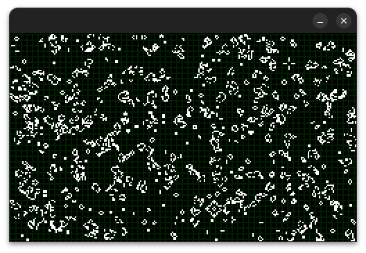

# Game of Life

This projects implements [Game of Life](https://en.wikipedia.org/wiki/Conway%27s_Game_of_Life) concept using SDL2.

[C++20](https://en.cppreference.com/w/cpp/20) revision is required.

## Contributing

Your project cannot be re-licensed under GPL or similar copyleft licenses.

Contributors agree to these terms when submitting their contributions.

Other than that, [Apache 2.0 License](LICENSE.md) applies.

## Table of Contents

0. [License](LICENSE.md)
1. [Developer's Guide](doc/developer.md)

## Sublicenses

* [Niels Lohmann JSON for Modern C++](doc/sublicenses/nlohmann-json.md)
* [SDL 2.0](doc/sublicenses/sdl20.md)
